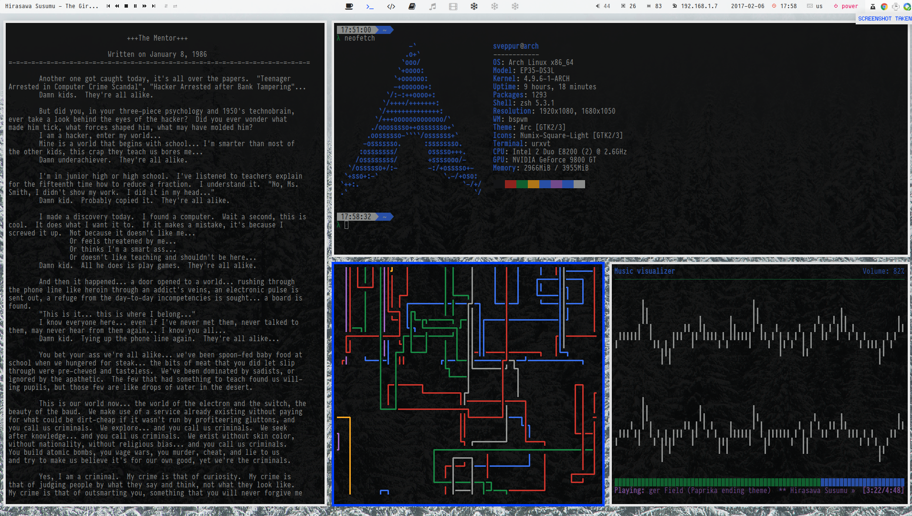

# dotfiles

Arch Linux dotfiles

- Window Manager: [bspwm](https://github.com/baskerville/bspwm)
- Bar: [polybar](https://github.com/jaagr/polybar)
- Terminal: [urxvt](https://en.wikipedia.org/wiki/Rxvt-unicode)
- Music Player: [ncmpcpp](https://wiki.archlinux.org/index.php/Ncmpcpp)
